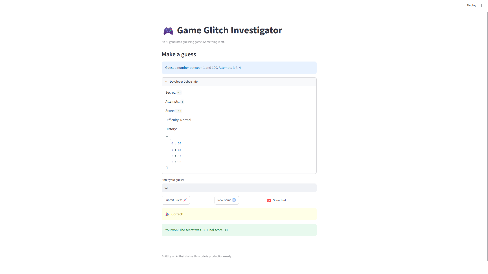

# 🎮 Game Glitch Investigator: The Impossible Guesser

## 🚨 The Situation

You asked an AI to build a simple "Number Guessing Game" using Streamlit.
It wrote the code, ran away, and now the game is unplayable. 

- You can't win.
- The hints lie to you.
- The secret number seems to have commitment issues.

## 🛠️ Setup

1. Install dependencies: `pip install -r requirements.txt`
2. Run the broken app: `python -m streamlit run app.py`

## 🕵️‍♂️ Your Mission

1. **Play the game.** Open the "Developer Debug Info" tab in the app to see the secret number. Try to win.
2. **Find the State Bug.** Why does the secret number change every time you click "Submit"? Ask ChatGPT: *"How do I keep a variable from resetting in Streamlit when I click a button?"*
3. **Fix the Logic.** The hints ("Higher/Lower") are wrong. Fix them.
4. **Refactor & Test.** - Move the logic into `logic_utils.py`.
   - Run `pytest` in your terminal.
   - Keep fixing until all tests pass!

## 📝 Document Your Experience

- [x] Describe the game's purpose.

The game's purpose is to teach students how to identify bugs, use AI to help debug code, test fixes, and verify that the program works correctly.

- [x] Detail which bugs you found.

1. The attempt counter was incorrect, causing the game to end earlier than expected.
2. The hints were backwards. A guess that was too high could tell the player to go higher instead of lower.
3. The secret number was changed from an integer to a string on some attempts, which caused incorrect comparisons.

- [x] Explain what fixes you applied.

1. I initialized the attempt counter at 0 so the number of attempts matches what the game displays.
2. I corrected the hint logic so a high guess says "Go LOWER!" and a low guess says "Go HIGHER!"
3. I removed the code that converted the secret number into a string so the guess and secret stay as integers.
4. I moved the guess-checking logic into logic_utils.py and tested it with pytest.
## 📸 Demo Walkthrough

1. User starts a new game and sees the allowed number range and attempts.
2. User enters a guess of 40.
3. If 40 is below the secret number, the game displays "Go HIGHER!"
4. User enters another guess above the secret number, and the game displays "Go LOWER!"
5. The score and remaining attempts update after each valid guess.
6. User enters the correct number.
7. The game displays the winning message and final score.
**Screenshot** *(optional)*: <!-- Insert a screenshot of your fixed, winning game here -->


## 🧪 Test Results

```text
python -m pytest

collected 3 items

tests/test_game_logic.py ...                                      [100%]

3 passed in 0.04s
```

## 🚀 Stretch Features

- [ ] [If you choose to complete Challenge 4, describe the Enhanced UI changes here — a screenshot is optional]
